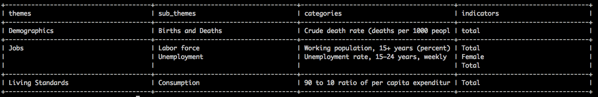

#   Prunner

Amazing project which helps people to see what they want to see - Nothing more! 


## Usage
To run this project you need
```
bundle install
```
and then just set the ids you want to see. If you want to see full table, just omit ids.
```
ruby ./bin/prune.rb 1 2 321 12 22 ...
```


## Edge cases

- Our `Printer` came from China, so it has some bugs with multi lining!
Need to wait for new patch 
- Need to validate payload from the server. _Who knows... maybe they will change their data structure_


